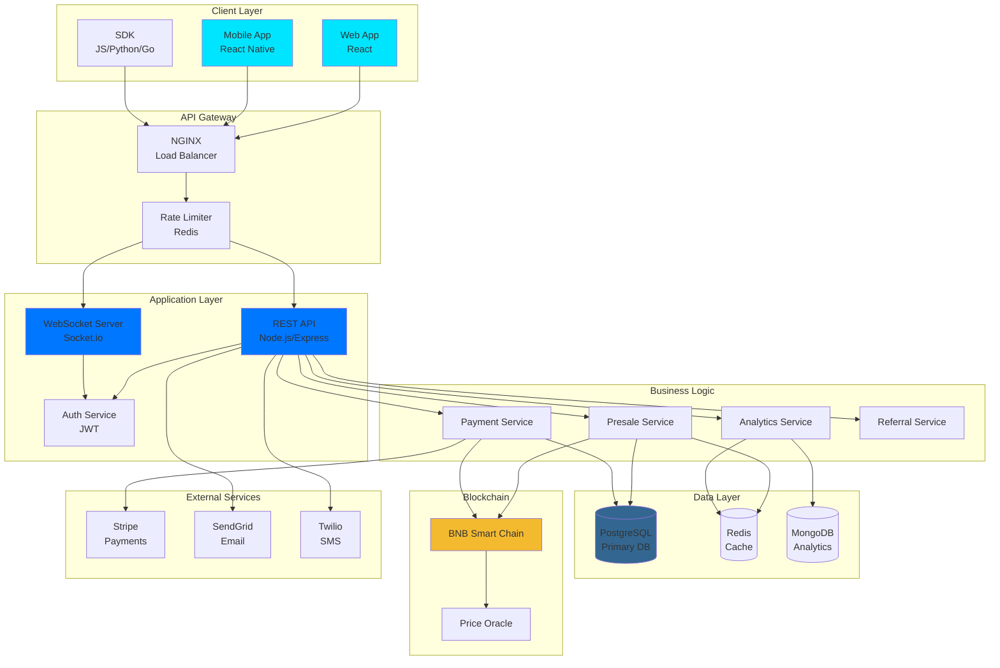
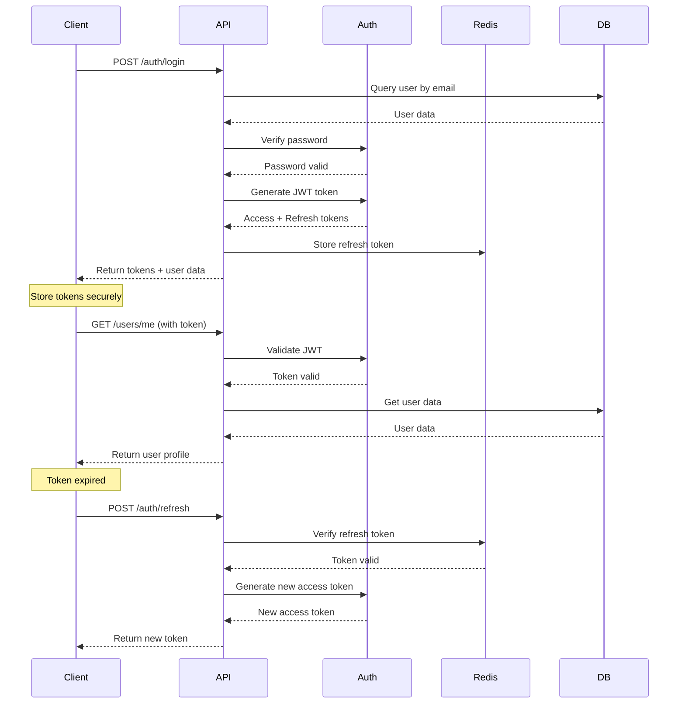
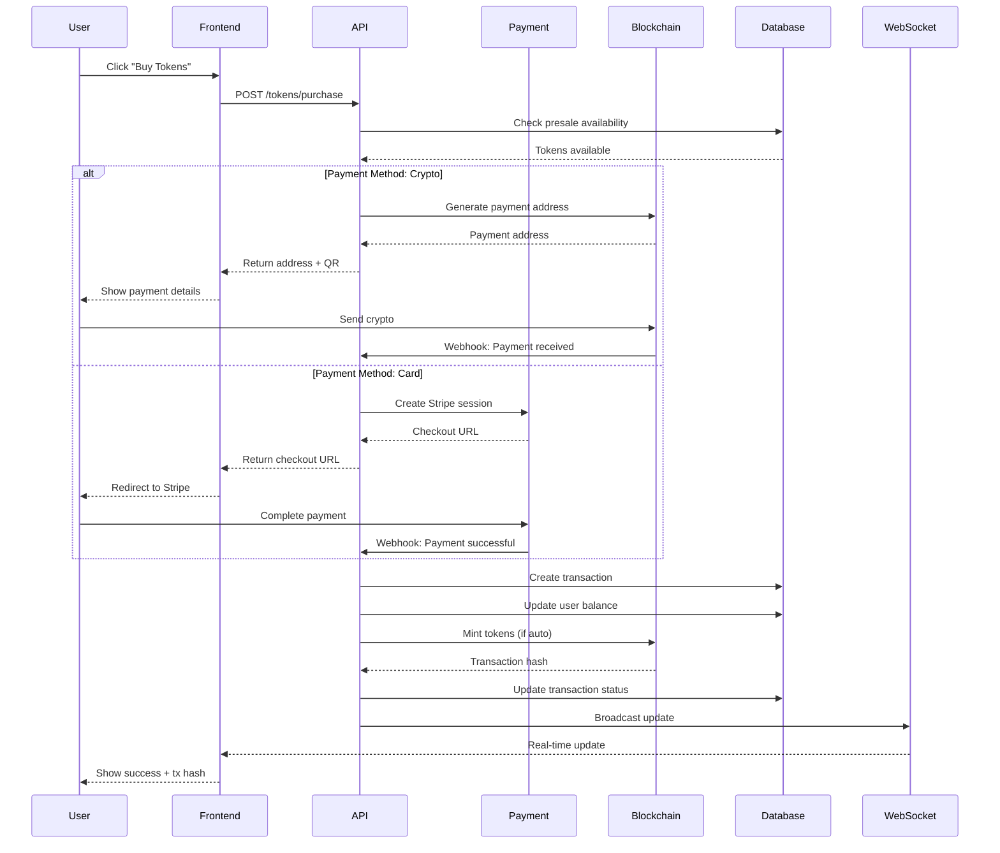
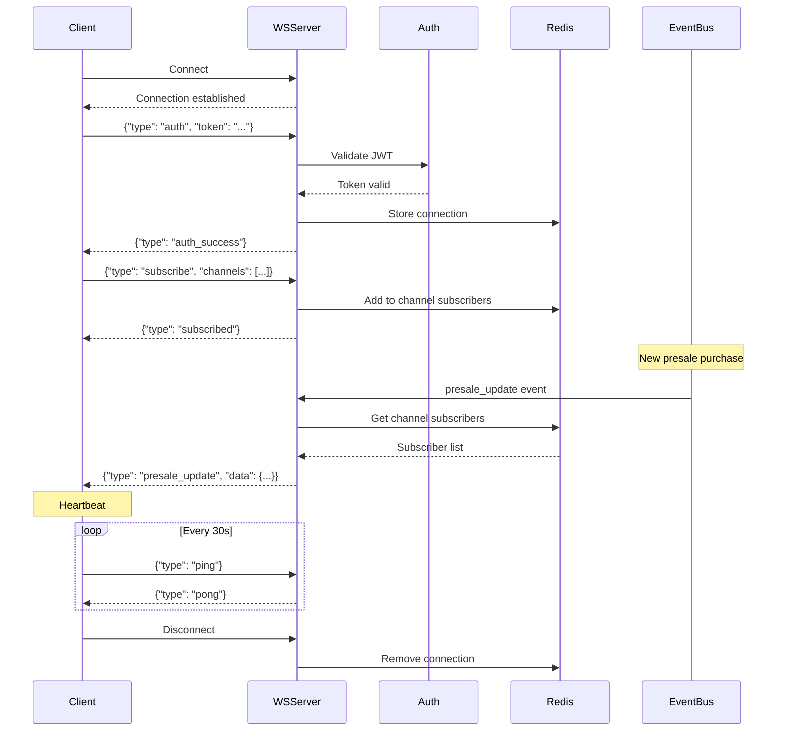
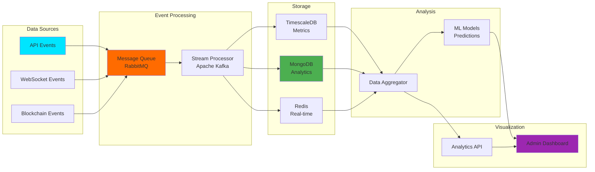
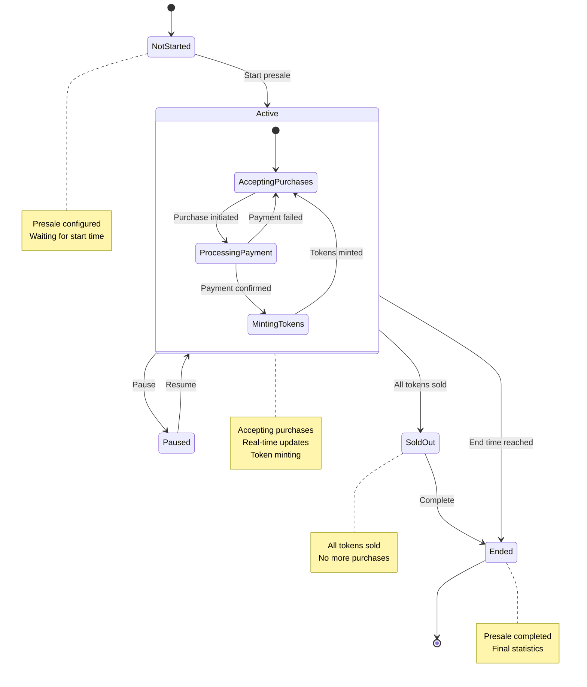
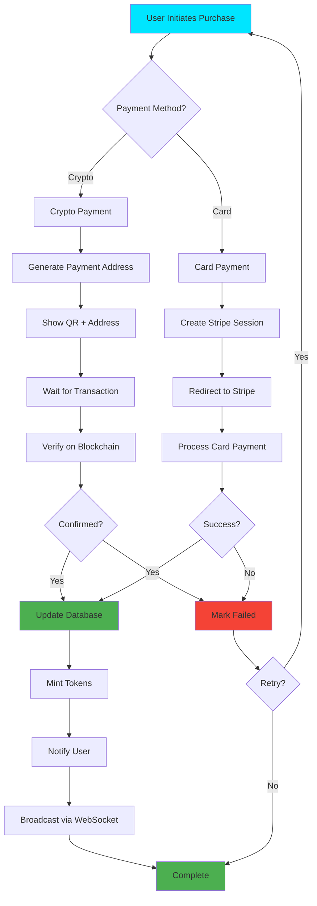
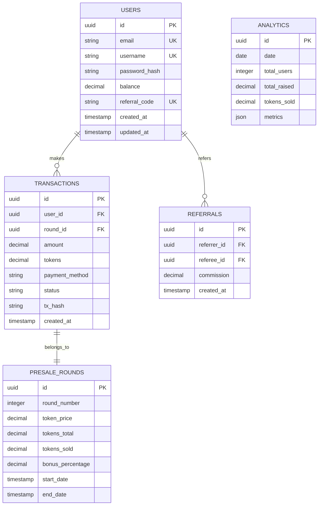
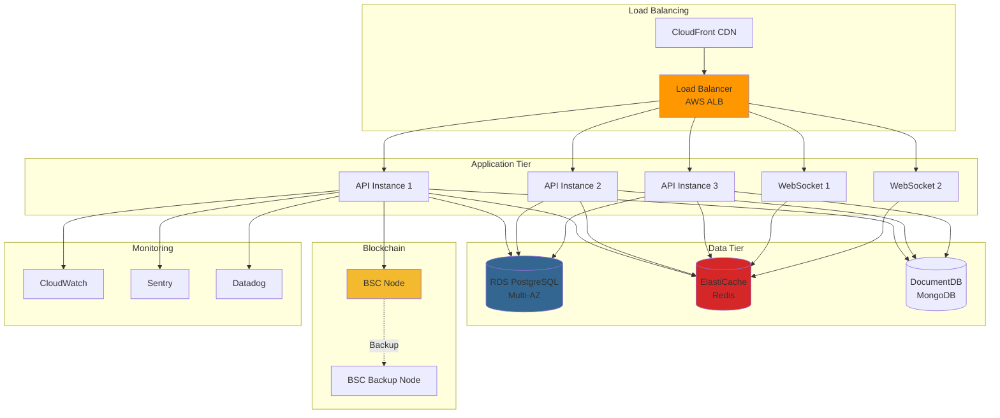
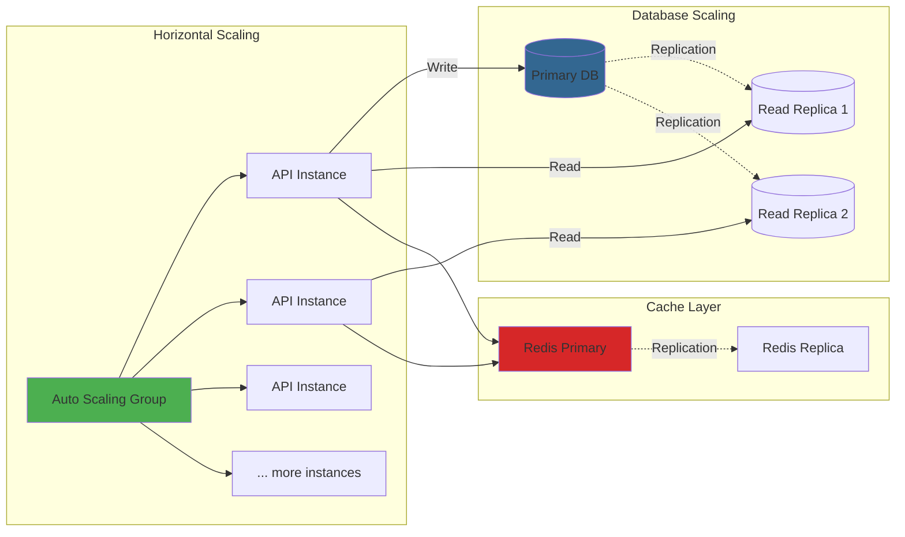

# Architecture Diagrams

Visual representation of HypeAI API architecture and data flows.

## 🏗️ System Architecture

## 🔐 Authentication Flow

## 💰 Token Purchase Flow

## 🌐 WebSocket Communication

## 📊 Analytics Pipeline

## 🔄 Presale State Machine

## 🏦 Payment Processing

## 🔍 Database Schema

## 🚀 Deployment Architecture

## 📈 Scaling Strategy

## 🔗 Related Documentation

- [API Reference](../spec/openapi.yaml)
- [Quickstart Guide](../guides/quickstart.md)
- [Authentication](../guides/authentication.md)
- [WebSocket Integration](../guides/websocket.md)
